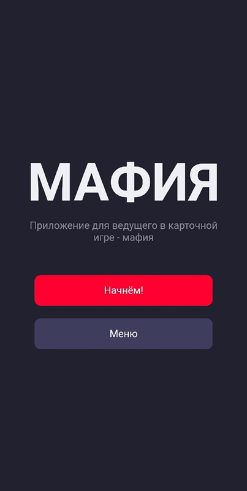
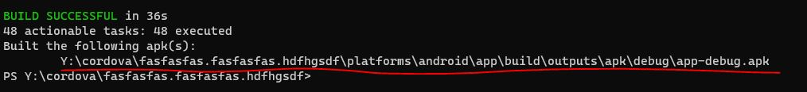

# Мобильное приложение для ведущего в карточной игре - "Мафия"

Мобильное приложение, созданное для помощи ведущему в раздаче ролей для карточной игры - "Мафия".

Можно скачать уже сейчас в [AppGallery.](https://clck.ru/sQtis)

## Возможности

✅ Раздача ролей игрокам

✅ Просмотр истории 100 последних раздач.

✅ Создание собственного набора ролей.

✅ Создание наборов (пресеты) для быстрой раздачи ролей.

✅ Хранение информации об игре в заметках.

✅ Поддерживается управление свайпами (для вызова меню быстрого выбора).

## Стек технологий
🟠 SvelteJS

⚪ Apache Cordova

## Сборка и установка

1.Для сборки приложения вам потребуется установить NodeJS на свой компьютер.
Скачать NodeJS можно по этой ссылке: [ссылка.](https://nodejs.org/ru/)

2.Далее необходимо установить Apache Cordova. 
Для этого в консоли введите следующую команду:
```sh
npm install -g cordova
```
Также необходимо установить JDK 8 по этой ссылке: [ссылка.](https://www.oracle.com/cis/java/technologies/javase/javase8-archive-downloads.html)

2.Теперь необходимо произвести сборку Svelte проекта.
Скачайте репозиторий в виде архива (нажав на кнопку "Download ZIP" в выпадающем меню "Code") и разархивируйте его в любую директорию.
После перейдите в данную директорию с помощью терминала и выполните следующую команду:
```sh
npm run build
```
После завершения выполнения команды в директории, куда вы разархивировали все файлы должна появится в директория "build" внутри директории "public". 
Если таковая директория имеется, значит сборка приложения прошла успешно.

3.Далее создайте ещё одну директорию с любым названием на "латинице" и перейдите по её пути в терминале.
В этой директории будет непосредственно осуществлятся сборка "APK" файла.
Находясь в данной директории выполните следующие команды:
```sh
 cordova create com.mafialeading.game
 cd com.mafialeading.game
```
4.У вас должно произвестись создание Apache Cordova проекта.
Теперь его необходимо сконфирурировать. Для этого измените параметры в файле config.xml.

- Параметр "id"в теге "widget" отвечает за уникальный ID приложения, который вы должны указать для приложения. Обратите внимание, если вы заходите выложить приложение в магазины, ваше ID не должно совпадать ни с одним другим уже имеющимся приложением в этом магазине.
- Gараметр "version" в теге "widget" отвечает за версию приложения. Тут можно указать любое циферное значение с разделителем через точку (Например: 1.0.0).
- Тег "name" отвечает за название приложения (Оно отобразится в меню приложений на устройстве).
- Тег "description" отвечает за описание приложения (Отобразится в сведениях о приложении).
- Тег "author" отвчает за ФИО автора приложения.
- Тег "icon" отвчает за иконку приложения.(Она отобразится в меню приложений на устройстве. Можно добавить сразу несколько иконок в конфиг для разных разрешений экрана).
- Вспомогательные теги: "<preference name="StatusBarOverlaysWebView" value="false" />" и "<preference name="StatusBarBackgroundColor" value="#22212F" />" не идут в стандартной поставке проекта, они добавлены лично мной и отвечают за цвет StatusBar во время работы приложения.

5.После конфигурации файла "config.xml" сконфигурируйте файл "package.json" теми же данными, что указывали в "config.xml". 
Далее, находясь в терминале в директории, где выполняли команды из шага №4 выполните следующие команды:
```sh
 cordova platform add android
 cordova plugin add cordova-plugin-screen-orientation
 cordova plugin add cordova-plugin-statusbar
```

6.Теперь перенесите все файлы из директории "public", из шага №2 в директорию "www" из шага №5.
7.Выполните сборку APK файла. Находясь в терминале в директории, где выполняли команды из шага №4 выполните следующую команду:
ДЛЯ ДЕБАГ ВЕРСИИ:
```sh
 cordova build
```
ДЛЯ РЕЛИЗ ВЕРСИИ:
```sh
 cordova build android --release 
```
В консоли после сборки должен отобразится путь до APK файла с собранным проектом:


## Лицензия

MIT

Текущая актуальная версия приложения в "AppGallery": 1.0.2.